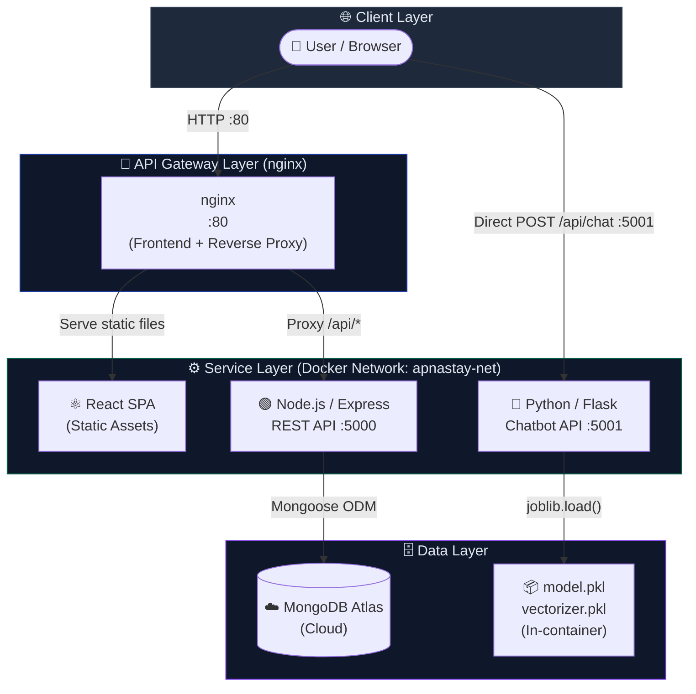
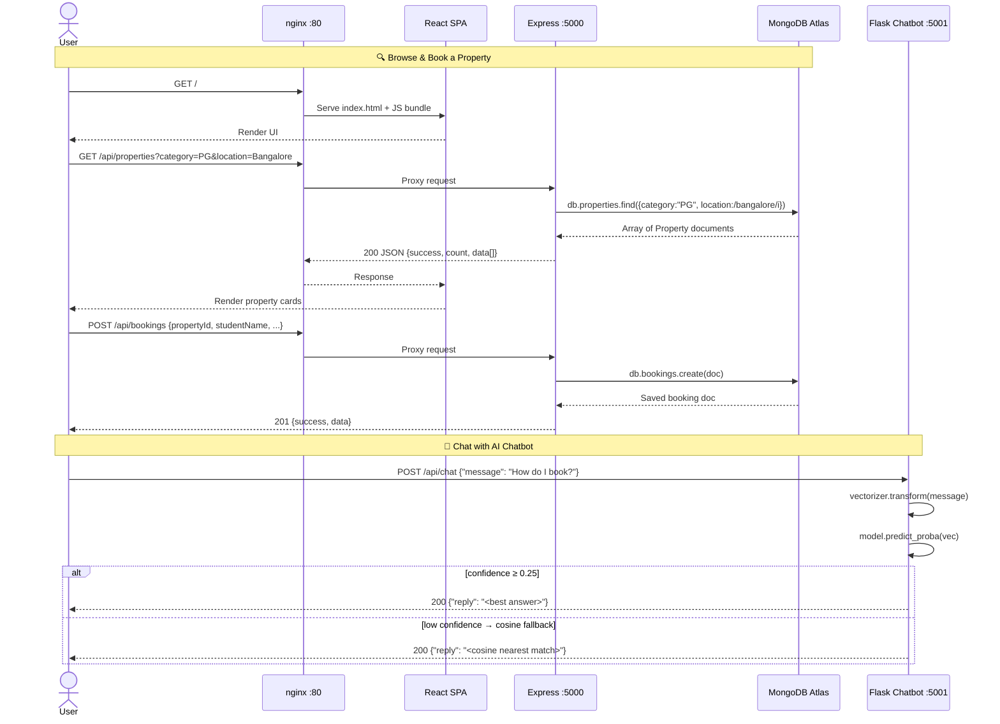
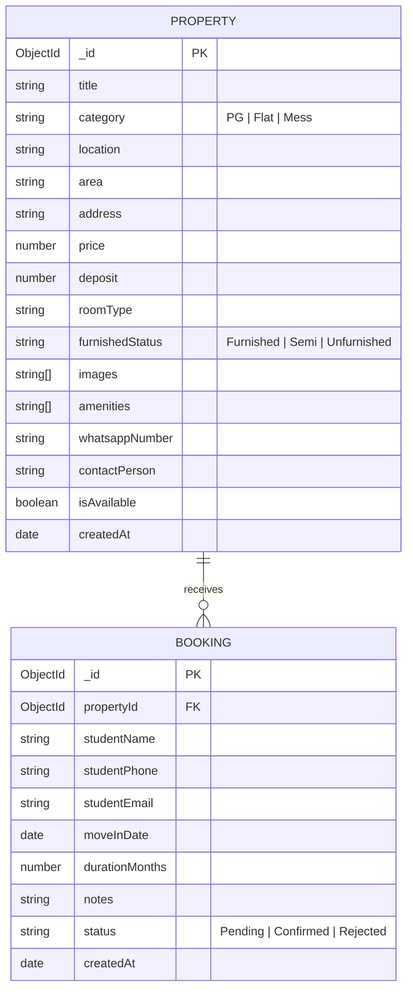
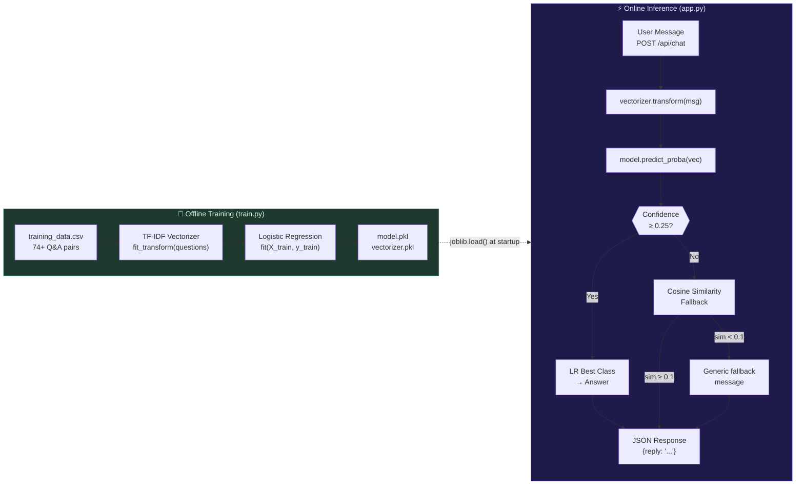
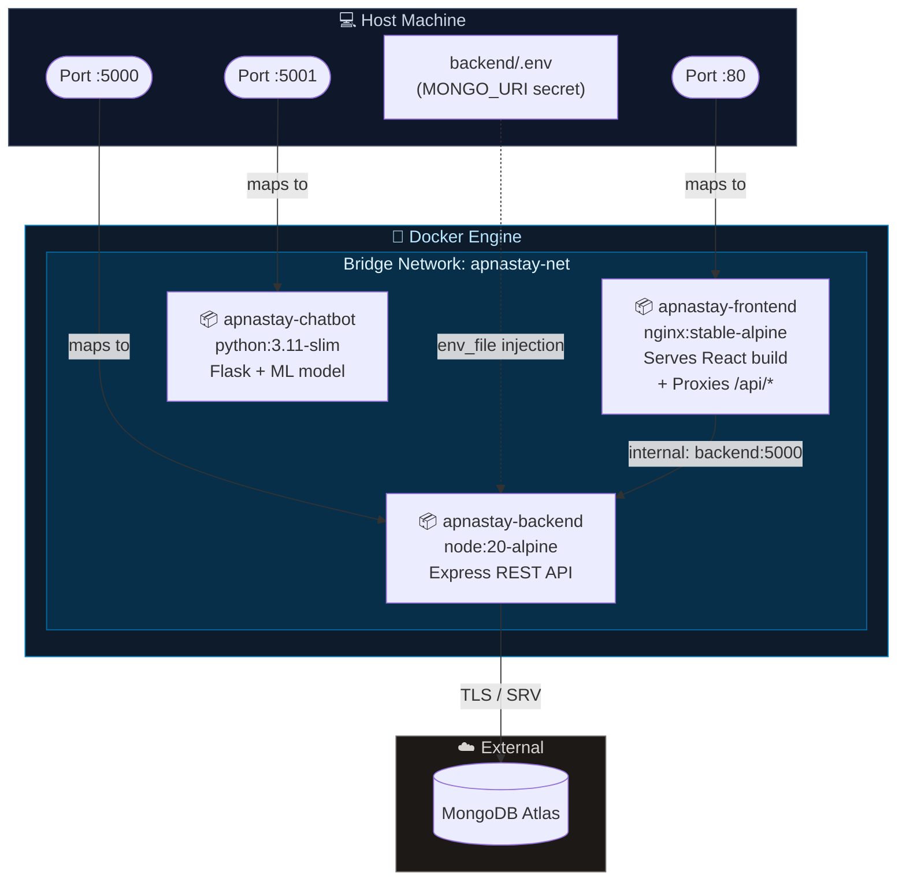

# 🏠 ApnaStay — Student Accommodation & Mess Discovery Platform

[](https://nodejs.org/)
[](https://expressjs.com/)
[](https://reactjs.org/)
[](https://vitejs.dev/)
[](https://tailwindcss.com/)
[](https://www.mongodb.com/cloud/atlas)
[](https://www.python.org/)
[](https://scikit-learn.org/)
[](https://www.docker.com/)
[](LICENSE)

A modern, full-stack web platform designed to simplify accommodation and food service discovery for college students, interns, and working professionals across major educational and IT hubs (e.g., Bangalore, Delhi, Kota, Pune).

The platform connects users with verified **PGs (Paying Guest accommodations)**, **Shared/Full Flats**, and **Mess & Food Facilities**, enabling seamless search, instant booking requests, direct landlord WhatsApp communication, an integrated admin management dashboard, and an **AI-powered chatbot** trained on custom Q&A data.

---

## 📋 Table of Contents

- [✨ Features](#-features)
- [🏛️ System Design](#️-system-design)
  - [High-Level Architecture](#high-level-architecture)
  - [Request Flow](#request-flow)
  - [Data Model](#data-model)
  - [AI Chatbot Pipeline](#ai-chatbot-pipeline)
  - [Docker Deployment Architecture](#docker-deployment-architecture)
- [💻 Tech Stack](#-tech-stack)
- [📁 Project Structure](#-project-structure)
- [⚙️ Prerequisites](#️-prerequisites)
- [🔐 Environment Configuration](#-environment-configuration)
- [🚀 Getting Started — Local Dev](#-getting-started--local-dev)
- [🐳 Getting Started — Docker](#-getting-started--docker)
- [🌱 Database Seeding](#-database-seeding)
- [📡 API Documentation](#-api-documentation)
- [🔑 Admin Portal & Workflow](#-admin-portal--workflow)
- [🔧 Troubleshooting & Gotchas](#-troubleshooting--gotchas)
- [📜 License](#-license)

---

## ✨ Features

### 🔍 For Students & Seekers

- **Multi-Criteria Search & Filtering** — Filter by Category (`PG`, `Flat`, `Mess`), Location, Area, Furnishing Status, Budget, and keywords
- **Rich Accommodation Details** — Image galleries, price breakdowns, room types, amenities, and owner profiles
- **Instant One-Click Booking** — Submit reservation requests with move-in dates and stay duration
- **Direct WhatsApp Integration** — Contact property owners via pre-configured WhatsApp chat links
- **🤖 AI Chatbot Assistant** — Floating chat bubble powered by a custom-trained ML model with typing indicators and smart fallback responses

### 🛡️ For Administrators & Property Owners

- **Full CRUD for Listings** — Create, edit, toggle availability, or delete properties with multi-image support
- **Booking Request Dashboard** — View, filter (`Pending`, `Confirmed`, `Rejected`), approve/reject bookings
- **One-Click Database Seeder** — Populate MongoDB with high-quality sample listings across multiple cities

### 🛠️ Developer & Integration Features

- **In-App API Guide** — Interactive Postman documentation modal baked into the frontend
- **Robust MongoDB Connection** — Built-in Google DNS fallback to fix Windows SRV lookup issues with Atlas
- **Custom-Trained NLP Model** — TF-IDF + Logistic Regression trained on 74+ Q&A pairs, served via Flask

---

## 🏛️ System Design

### High-Level Architecture

The application follows a **three-tier microservice architecture** composed of independently deployable services that communicate over a shared Docker bridge network in production.



---

### Request Flow

This diagram traces the complete lifecycle of two core user journeys.



---

### Data Model



---

### AI Chatbot Pipeline



---

### Docker Deployment Architecture



---

## 💻 Tech Stack

### Frontend

| Tool         | Version | Purpose                 |
| ------------ | ------- | ----------------------- |
| React        | 18.3    | UI component framework  |
| Vite         | 5.3     | Build tool & dev server |
| Tailwind CSS | 3.4     | Utility-first styling   |
| Lucide React | 0.395   | Icon library            |
| Axios        | 1.7     | HTTP client             |

### Backend

| Tool          | Version | Purpose                       |
| ------------- | ------- | ----------------------------- |
| Node.js       | 20+     | Runtime                       |
| Express.js    | 4.19    | REST API framework            |
| Mongoose      | 8.5     | MongoDB ODM                   |
| MongoDB Atlas | —       | Cloud database                |
| dotenv        | 16.4    | Env variable management       |
| cors          | 2.8     | Cross-origin request handling |

### AI Chatbot

| Tool           | Version | Purpose                      |
| -------------- | ------- | ---------------------------- |
| Python         | 3.11+   | Runtime                      |
| Flask          | latest  | HTTP API server              |
| Flask-CORS     | latest  | Cross-origin support         |
| scikit-learn   | latest  | TF-IDF + Logistic Regression |
| joblib         | latest  | Model serialization (.pkl)   |
| pandas / numpy | latest  | Data handling                |

### DevOps & Infrastructure

| Tool                | Purpose                             |
| ------------------- | ----------------------------------- |
| Docker              | Container runtime                   |
| Docker Compose v2   | Multi-service orchestration         |
| nginx:stable-alpine | Static file serving + reverse proxy |

---

## 📁 Project Structure

```text
apnastay/
├── 🐳 docker-compose.yaml       ← Orchestrates all 3 services
├── 🚫 .dockerignore             ← Excludes node_modules, .env, dist, etc.
├── 📖 DOCKER.md                 ← Docker usage guide
├── 📖 README.md
│
├── backend/                     ← Node.js / Express REST API
│   ├── models/
│   │   ├── Booking.js           # Mongoose schema — booking requests
│   │   └── Property.js          # Mongoose schema — PGs, Flats, Messes
│   ├── routes/
│   │   ├── propertyRoutes.js    # /api/properties (CRUD)
│   │   ├── bookingRoutes.js     # /api/bookings (CRUD + status)
│   │   ├── seedRoutes.js        # /api/seed
│   │   ├── adminRoutes.js       # /api/admin
│   │   └── userRoutes.js        # /api/users
│   ├── utils/
│   ├── .env                     # MONGO_URI, PORT (git-ignored)
│   ├── server.js                # App entry — Express setup + DB connect
│   ├── package.json
│   └── 🐳 Dockerfile           ← node:20-alpine, multi-stage
│
├── chatbot/                     ← Python / Flask ML chatbot
│   ├── data/
│   │   └── training_data.csv   # 74+ Q&A pairs (question, answer)
│   ├── model.pkl               # Trained LR model (generated by train.py)
│   ├── vectorizer.pkl          # Fitted TF-IDF vectorizer (generated)
│   ├── train.py                # Offline training script
│   ├── app.py                  # Flask chatbot API server :5001
│   ├── requirements.txt
│   └── 🐳 Dockerfile          ← python:3.11-slim
│
└── frontend/                   ← React + Vite SPA
    ├── src/
    │   ├── components/
    │   │   ├── AboutModal.jsx
    │   │   ├── AdminLoginModal.jsx
    │   │   ├── AdminPortal.jsx
    │   │   ├── BookingModal.jsx
    │   │   ├── ChatbotWidget.jsx   # ← Floating AI chat bubble
    │   │   ├── Footer.jsx
    │   │   ├── HeroSearch.jsx
    │   │   ├── Navbar.jsx
    │   │   ├── PostmanGuideModal.jsx
    │   │   ├── PropertyCard.jsx
    │   │   └── PropertyDetailModal.jsx
    │   ├── App.jsx
    │   ├── index.css
    │   └── main.jsx
    ├── index.html
    ├── vite.config.js
    ├── tailwind.config.js
    ├── nginx.conf              # SPA routing + /api proxy config
    └── 🐳 Dockerfile         ← Vite build → nginx:stable-alpine
```

---

## ⚙️ Prerequisites

### For Local Development

| Requirement           | Version | Check                                          |
| --------------------- | ------- | ---------------------------------------------- |
| Node.js               | v18+    | `node --version`                               |
| npm                   | v9+     | `npm --version`                                |
| Python                | 3.11+   | `python --version`                             |
| MongoDB Atlas account | —       | [cloud.mongodb.com](https://cloud.mongodb.com) |

### For Docker

| Requirement    | Version | Check                    |
| -------------- | ------- | ------------------------ |
| Docker Desktop | 24.x+   | `docker --version`       |
| Docker Compose | v2.x+   | `docker compose version` |

---

## 🔐 Environment Configuration

Create or update `backend/.env`:

```env
PORT=5000
MONGO_URI=mongodb+srv://<username>:<password>@cluster0.zpkiaxy.mongodb.net/mess_hunting?retryWrites=true&w=majority
```

> [!CAUTION]
> Never commit `.env` to Git. It is already covered by `.gitignore` and `.dockerignore`.

> [!NOTE]
> If `MONGO_URI` is missing, the backend will log an error and exit with code 1.

---

## 🚀 Getting Started — Local Dev

You need **three terminal windows** running simultaneously.

### 1. Clone the Repository

```bash
git clone https://github.com/codebyharsh01/ApnaStay.git
cd apnastay
```

### 2. Backend (Terminal 1)

```bash
cd backend
npm install
npm start
# → http://localhost:5000
```

### 3. Chatbot AI (Terminal 2)

```bash
cd chatbot
pip install -r requirements.txt

# Train the model once (or when you update training_data.csv)
python train.py

# Start the Flask API
python app.py
# → http://localhost:5001
```

Expected training output:

```
[*] Loading training data from: .../chatbot/data/training_data.csv
[+] Loaded 74 Q&A pairs.
[+] Training accuracy: 100.0%
[+] model.pkl saved -> .../chatbot/model.pkl
[+] vectorizer.pkl saved -> .../chatbot/vectorizer.pkl
[OK] Training complete!
```

### 4. Frontend (Terminal 3)

```bash
cd frontend
npm install
npm run dev
# → http://localhost:5173
```

Open **http://localhost:5173** — the 💬 AI chat bubble appears in the bottom-right corner.

---

## 🐳 Getting Started — Docker

> Full Docker guide: [DOCKER.md](./DOCKER.md)

### Quick Start (3 commands)

```bash
# 1. Ensure backend/.env has your MONGO_URI
# 2. Build all images
docker compose build

# 3. Start all services
docker compose up -d
```

| Service              | URL                              |
| -------------------- | -------------------------------- |
| **Frontend (nginx)** | http://localhost                 |
| **Backend API**      | http://localhost:5000/api/health |
| **Chatbot API**      | http://localhost:5001/api/health |

### Common Docker Commands

```bash
docker compose up -d          # Start in background
docker compose logs -f        # Tail logs (all services)
docker compose logs -f backend # Tail a single service
docker compose ps             # Check container status
docker compose down           # Stop & remove containers
docker compose build --no-cache  # Force full rebuild
```

---

## 🌱 Database Seeding

To populate MongoDB with sample PGs, Flats, and Messes across Bangalore, Delhi, Kota, and Pune:

**Option A — via Admin Portal UI:**

1. Open the app → click **Admin Portal** in the navbar
2. Click **"Reset / Seed Database"**

**Option B — via HTTP:**

```bash
curl -X POST http://localhost:5000/api/seed
```

---

## 📡 API Documentation

### Health Check

#### `GET /api/health`

```json
{
  "status": "API operational",
  "timestamp": "2026-08-18T00:00:00.000Z",
  "dbState": "Connected to MongoDB Atlas",
  "mongoUriConfigured": true
}
```

---

### Properties Endpoints

| Method   | Endpoint              | Description                       |
| -------- | --------------------- | --------------------------------- |
| `GET`    | `/api/properties`     | List all (supports query filters) |
| `GET`    | `/api/properties/:id` | Get single property               |
| `POST`   | `/api/properties`     | Create new listing                |
| `PUT`    | `/api/properties/:id` | Update listing                    |
| `DELETE` | `/api/properties/:id` | Delete listing                    |

**Query Parameters for `GET /api/properties`:**

| Param             | Values                                           | Description                 |
| ----------------- | ------------------------------------------------ | --------------------------- |
| `category`        | `PG` \| `Flat` \| `Mess` \| `All`                | Filter by type              |
| `location`        | string                                           | Case-insensitive city match |
| `area`            | string                                           | Neighbourhood filter        |
| `furnishedStatus` | `Furnished` \| `Semi-Furnished` \| `Unfurnished` | Filter                      |
| `maxPrice`        | number                                           | Upper rent limit            |
| `search`          | string                                           | Full-text keyword search    |

**`POST /api/properties` — Request Body:**

```json
{
  "title": "Sunrise Student PG",
  "category": "PG",
  "location": "Bangalore",
  "area": "Koramangala",
  "address": "42, 8th Main Road",
  "price": 8500,
  "deposit": 10000,
  "roomType": "Double Sharing",
  "furnishedStatus": "Furnished",
  "images": ["https://images.unsplash.com/..."],
  "amenities": ["High-speed Wi-Fi", "Daily 3-Time Food", "AC Room"],
  "whatsappNumber": "919876543210",
  "contactPerson": "Ramesh Owner"
}
```

---

### Bookings Endpoints

| Method   | Endpoint                   | Description                           |
| -------- | -------------------------- | ------------------------------------- |
| `POST`   | `/api/bookings`            | Submit booking request                |
| `GET`    | `/api/bookings`            | List all bookings (`?status=Pending`) |
| `PATCH`  | `/api/bookings/:id/status` | Update booking status                 |
| `DELETE` | `/api/bookings/:id`        | Delete booking record                 |

**`POST /api/bookings` — Request Body:**

```json
{
  "propertyId": "64f1a2b3c4d5e6f7a8b9c0d1",
  "studentName": "Rahul Sharma",
  "studentPhone": "919876543210",
  "studentEmail": "rahul.sharma@example.com",
  "moveInDate": "2026-09-01",
  "durationMonths": 6,
  "notes": "Prefer upper floor room."
}
```

**`PATCH /api/bookings/:id/status` — Request Body:**

```json
{ "status": "Confirmed" }
```

Valid values: `Pending` | `Confirmed` | `Rejected`

---

### Seed Endpoint

#### `POST /api/seed`

Clears existing records and inserts default sample properties & bookings.

---

### Chatbot Endpoint

The chatbot runs as a **separate Flask service on port 5001**.

#### `POST /api/chat`

```json
// Request
{ "message": "How do I book a mess?" }

// Response 200
{ "reply": "Open the mess listing, review the details, and submit your booking request." }

// Low-confidence fallback
{ "reply": "I'm not sure about that. Please contact support or browse our listings." }
```

#### `GET /api/health` _(chatbot)_

```json
{ "status": "ok", "model": "loaded" }
```

> [!TIP]
> To train the chatbot on new data: edit `chatbot/data/training_data.csv` (add `question`,`answer` rows), then run `python train.py`.

---

## 🔑 Admin Portal & Workflow

Access via the **"Admin Portal"** button in the navbar.

**Listing Management:**

- Add properties with image URLs, amenities, prices, and WhatsApp numbers
- Edit or toggle availability of existing listings
- Remove out-of-service listings

**Booking Management:**

- Monitor real-time student reservation inquiries
- Mark as **Confirmed** or **Rejected**
- Contact applicants using recorded details

---

## 🔧 Troubleshooting & Gotchas

| Issue                                      | Cause                                 | Fix                                                                             |
| ------------------------------------------ | ------------------------------------- | ------------------------------------------------------------------------------- |
| MongoDB Atlas connection timeout (Windows) | ISP DNS fails to resolve SRV records  | `server.js` auto-forces Google DNS `8.8.8.8` at startup                         |
| CORS errors                                | Backend not running on `:5000`        | Ensure Express backend is running; CORS is enabled for `:5173`                  |
| Chatbot "Could not connect to AI server"   | Flask not running or `.pkl` missing   | Run `python train.py` then `python app.py`                                      |
| `multi_class` FutureWarning (scikit-learn) | scikit-learn ≥ 1.5 deprecation        | Non-breaking warning; will be fixed in next update                              |
| UnicodeEncodeError on Windows terminal     | `cp1252` console can't render emoji   | All Python `print()` statements avoid emoji characters                          |
| Docker port conflict                       | Another process using `:80` / `:5000` | `netstat -ano \| findstr :80` → kill PID or remap port in `docker-compose.yaml` |
| Frontend shows stale version after rebuild | Docker layer cache                    | `docker compose build --no-cache frontend && docker compose up -d frontend`     |

---

## 📜 License

This project is open-source and available under the [MIT License](LICENSE).
